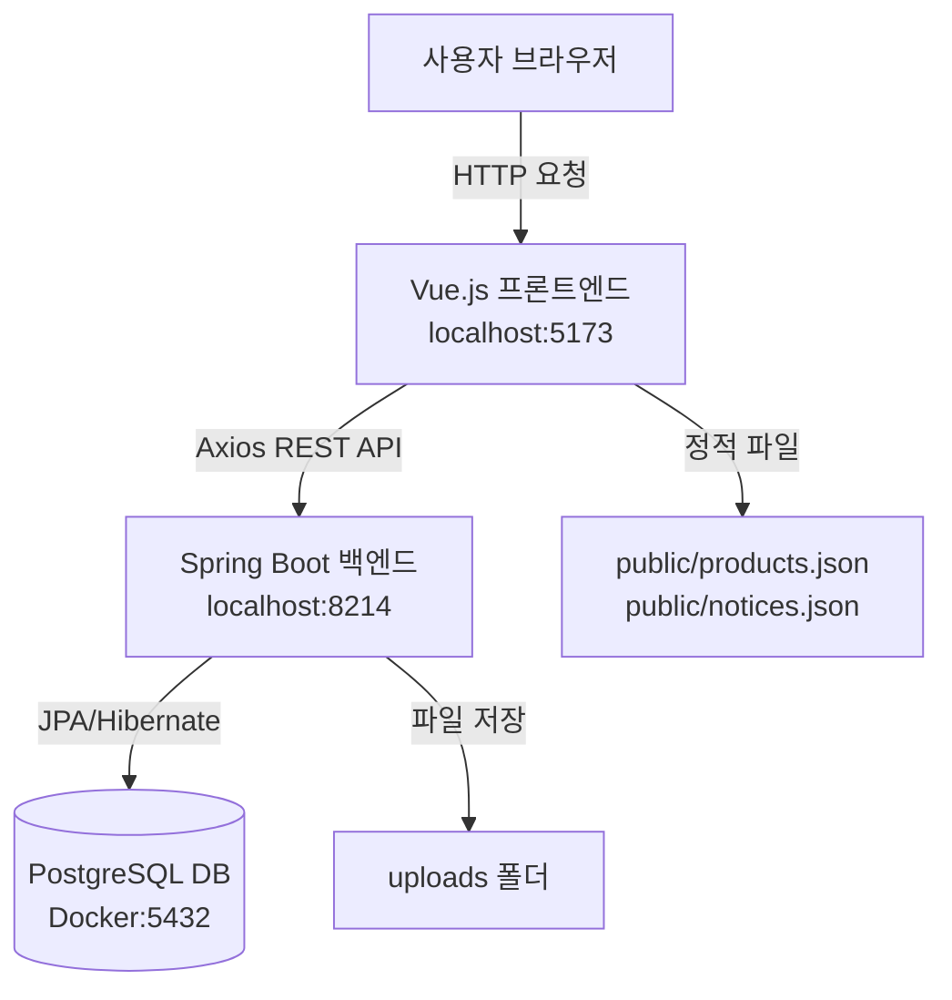
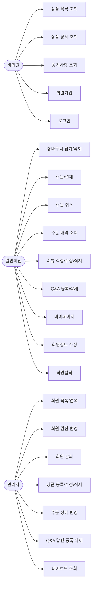
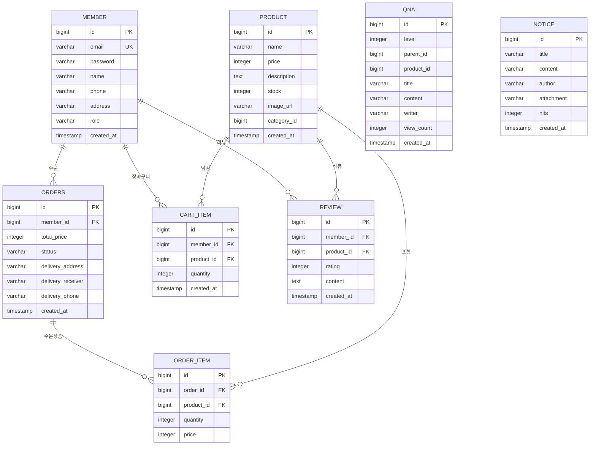
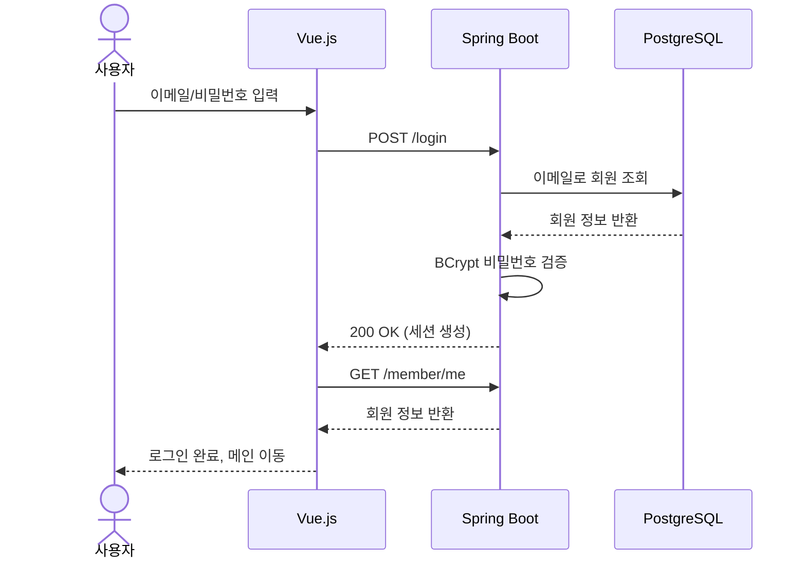
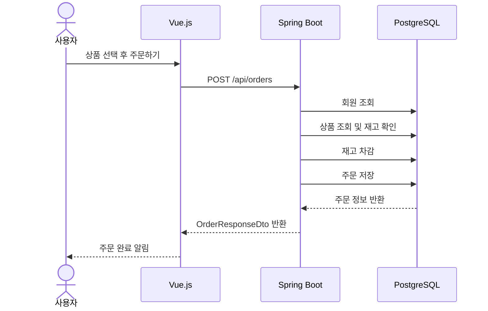

# 🥗 TeamKeto 쇼핑몰

> 키토제닉 다이어트 식단 브랜드 **팀키토**의 쇼핑몰 웹 애플리케이션

---

## 📌 프로젝트 개요

### 개발 목적
팀키토(TeamKeto)는 키토제닉(저탄고지) 식단 전문 브랜드로, 도시락·커피·헬시푸드 등 다양한 건강식 제품을 판매합니다.  
본 프로젝트는 팀키토의 온라인 쇼핑몰을 구현하여 고객이 편리하게 상품을 탐색하고 주문할 수 있는 환경을 제공하는 것을 목적으로 합니다.

### 어플리케이션 소개
- **일반 회원**: 회원가입/로그인, 상품 목록/상세 조회, 장바구니, 주문/결제, 리뷰 작성, Q&A 등록
- **관리자**: 회원 관리, 상품 관리, 주문 관리, 대시보드

### 개발 기간
- 2026.03.03 ~ 2026.03.17

### 참고 사이트
- [TeamKeto 공식 사이트](https://teamketo.shop/)
- [TeamKeto 네이버 스마트스토어](https://smartstore.naver.com/teamketo)

---

## 🛠 시스템 개요

### 개발 환경

| 구분 | 내용 |
|------|------|
| OS | Windows 11 |
| IDE | IntelliJ IDEA, VS Code |
| JDK | Java 21 |
| Node.js | v20+ |
| DB | PostgreSQL 18 (Docker) |
| 형상관리 | GitHub |

### 기술 스택

| 구분 | 기술 |
|------|------|
| 백엔드 | Spring Boot 3.5.11 |
| 프론트엔드 | Vue.js 3, Vite |
| 데이터베이스 | PostgreSQL 18 |
| ORM | Spring Data JPA (Hibernate) |
| 보안 | Spring Security |
| CSS | Tailwind CSS |
| 상태관리 | Pinia |
| HTTP 클라이언트 | Axios |
| 컨테이너 | Docker |

### 주요 라이브러리

**백엔드**
- `spring-boot-starter-web` - REST API
- `spring-boot-starter-data-jpa` - ORM
- `spring-boot-starter-security` - 인증/인가
- `spring-boot-starter-validation` - 폼 검증
- `postgresql` - DB 드라이버
- `lombok` - 보일러플레이트 코드 제거

**프론트엔드**
- `vue-router` - SPA 라우팅
- `pinia` - 상태 관리
- `axios` - HTTP 통신
- `tailwindcss` - CSS 유틸리티

---

## 🏗 시스템 구조도



### 디렉토리 구조

```
teamketo/
├── backend/
│   └── shop/
│       └── src/main/java/com/teamketo/shop/
│           ├── config/         # Security, Web 설정
│           ├── controller/     # REST API 컨트롤러
│           ├── dto/            # 데이터 전송 객체
│           ├── entity/         # JPA 엔티티
│           ├── repository/     # Spring Data JPA
│           ├── service/        # 비즈니스 로직
│           └── util/           # 파일 업로드 유틸
└── frontend/
    └── shop/
        └── src/
            ├── api/            # Axios 설정
            ├── components/     # Header, Footer
            ├── router/         # Vue Router
            ├── store/          # Pinia 스토어
            └── views/          # 페이지 컴포넌트
```

---

## 📋 프로젝트 기획서

### 사용자 시나리오 (유스케이스)



---

### 데이터베이스 설계



---

### 애플리케이션 설계 (시퀀스)

#### 로그인 시퀀스


#### 주문 시퀀스


---

## 🗂 카테고리 구조

| categoryId | 카테고리명 |
|-----------|-----------|
| 1 | 저포드맵 |
| 2 | 슬로우에이징 |
| 3 | 오리지널 |
| 4 | 시그니처 |
| 5 | 더클린커피 |
| 6 | 헬시푸드 |

---

## 🔐 권한 구조

| Role | 설명 |
|------|------|
| USER | 일반 회원 |
| MANAGER | 중간 관리자 |
| ADMIN | 최고 관리자 |

---

## 🚀 실행 방법

### 사전 요구사항
- Java 21
- Node.js 20+
- Docker

### 백엔드 실행
```bash
# PostgreSQL 컨테이너 실행
docker start shop-postgres

# Spring Boot 실행 (IntelliJ 또는)
./gradlew bootRun
```

### 프론트엔드 실행
```bash
cd frontend/shop
npm install
npm run dev
```

### 접속
- 프론트엔드: http://localhost:5173
- 백엔드: http://localhost:8214

### 초기 데이터
스프링 부트 실행 후 `shop.sql` 실행하여 초기 데이터 삽입

---

## 📡 주요 API 명세

### 회원 API

| Method | URL | 설명 | 권한 |
|--------|-----|------|------|
| POST | /signup | 회원가입 | 전체 |
| POST | /login | 로그인 | 전체 |
| POST | /logout | 로그아웃 | 로그인 |
| GET | /member/me | 내 정보 조회 | 전체 |
| PUT | /{id} | 회원정보 수정 | 로그인 |
| PUT | /{id}/password | 비밀번호 변경 | 로그인 |
| DELETE | /{id} | 회원탈퇴 | 로그인 |

### 상품 API

| Method | URL | 설명 | 권한 |
|--------|-----|------|------|
| GET | /api/products | 전체 상품 목록 | 전체 |
| GET | /api/products/{id} | 상품 상세 | 전체 |
| GET | /api/products/category/{categoryId} | 카테고리별 상품 | 전체 |
| GET | /api/products/search?name= | 상품 검색 | 전체 |
| POST | /api/products/admin | 상품 등록 | ADMIN |
| PUT | /api/products/admin/{id} | 상품 수정 | ADMIN |
| DELETE | /api/products/admin/{id} | 상품 삭제 | ADMIN |

### 장바구니 API

| Method | URL | 설명 | 권한 |
|--------|-----|------|------|
| POST | /api/cart | 장바구니 담기 | 로그인 |
| GET | /api/cart/{memberId} | 장바구니 조회 | 로그인 |
| PUT | /api/cart/{cartItemId} | 수량 변경 | 로그인 |
| DELETE | /api/cart/{cartItemId} | 단건 삭제 | 로그인 |
| DELETE | /api/cart/clear/{memberId} | 전체 삭제 | 로그인 |

### 주문 API

| Method | URL | 설명 | 권한 |
|--------|-----|------|------|
| POST | /api/orders | 주문 생성 | 로그인 |
| GET | /api/orders/my/{memberId} | 내 주문 목록 | 로그인 |
| GET | /api/orders/{orderId} | 주문 상세 | 로그인 |
| PUT | /api/orders/{orderId}/cancel | 주문 취소 | 로그인 |
| GET | /api/orders/admin | 전체 주문 목록 | ADMIN |
| PUT | /api/orders/admin/{orderId}/status | 주문 상태 변경 | ADMIN |

### 리뷰 API

| Method | URL | 설명 | 권한 |
|--------|-----|------|------|
| POST | /api/reviews | 리뷰 등록 | 로그인 |
| GET | /api/reviews/product/{productId} | 상품별 리뷰 | 전체 |
| GET | /api/reviews/my/{memberId} | 내 리뷰 목록 | 로그인 |
| PUT | /api/reviews/{reviewId} | 리뷰 수정 | 로그인 |
| DELETE | /api/reviews/{reviewId} | 리뷰 삭제 | 로그인 |
| GET | /api/reviews/admin | 전체 리뷰 | ADMIN |

### Q&A API

| Method | URL | 설명 | 권한 |
|--------|-----|------|------|
| GET | /api/qna/list | Q&A 목록 | 전체 |
| GET | /api/qna/search?title= | Q&A 검색 | 전체 |
| POST | /api/qna/question | 질문 등록 | 로그인 |
| POST | /api/qna/answer/{parentId} | 답변 등록 | ADMIN |
| PUT | /api/qna/update/{id} | 수정 | 로그인 |
| DELETE | /api/qna/delete/{id} | 삭제 | 로그인 |

---

## 📁 주요 파일 구조

```
backend/shop/src/main/java/com/teamketo/shop/
├── config/
│   ├── PasswordConfig.java
│   ├── SecurityConfig.java
│   └── WebConfig.java
├── controller/
│   ├── AdminController.java
│   ├── CartApiController.java
│   ├── MemberApiController.java
│   ├── NoticeApiController.java
│   ├── OrderApiController.java
│   ├── ProductController.java
│   ├── QnaApiController.java
│   └── ReviewApiController.java
├── dto/
│   ├── MemberResponseDto.java
│   └── OrderResponseDto.java
├── entity/
│   ├── CartItem.java
│   ├── Member.java
│   ├── Notice.java
│   ├── Order.java
│   ├── OrderItem.java
│   ├── OrderStatus.java
│   ├── Product.java
│   ├── Qna.java
│   ├── Review.java
│   └── Role.java
├── repository/
│   ├── BoardRepository.java
│   ├── CartItemRepository.java
│   ├── MemberRepository.java
│   ├── NoticeRepository.java
│   ├── OrderItemRepository.java
│   ├── OrderRepository.java
│   ├── ProductRepository.java
│   ├── QnaRepository.java
│   └── ReviewRepository.java
├── service/
│   ├── BoardService.java
│   ├── CartService.java
│   ├── MemberService.java
│   ├── NoticeService.java
│   ├── OrderService.java
│   ├── ProductService.java
│   ├── QnaService.java
│   └── ReviewService.java
└── util/
    ├── FileUploadUtil.java
    └── PasswordEncoderTest.java

frontend/shop/src/
├── api/axios.js
├── components/
│   ├── Header.vue
│   └── Footer.vue
├── router/index.js
├── store/
│   ├── cartStore.js
│   ├── memberStore.js
│   ├── orderStore.js
│   └── productStore.js
└── views/
    ├── AdminDashboard.vue
    ├── AdminMembers.vue
    ├── AdminProducts.vue
    ├── Cart.vue
    ├── Home.vue
    ├── Login.vue
    ├── MemberUpdate.vue
    ├── NoticeDetail.vue
    ├── NoticeList.vue
    ├── Order.vue
    ├── OrderList.vue
    ├── ProductDetail.vue
    ├── ProductList.vue
    ├── Profile.vue
    ├── QnaList.vue
    └── Signup.vue
```