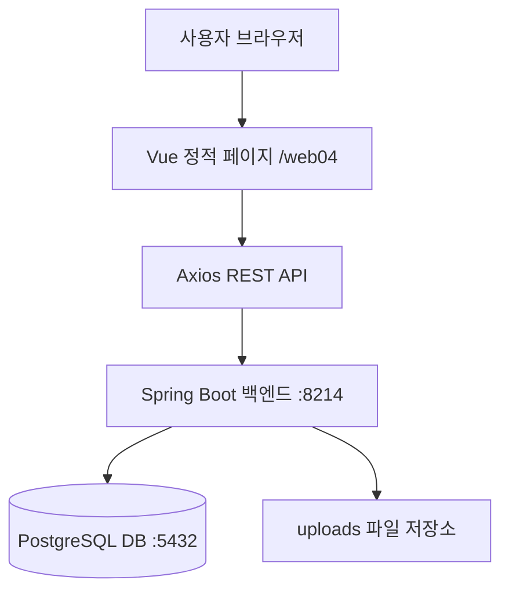
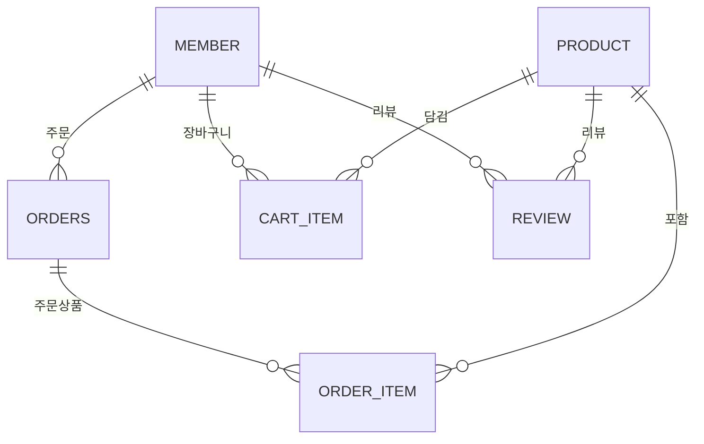

# TeamKeto 쇼핑몰

키토제닉 다이어트 식단 브랜드 **팀키토(TeamKeto)** 쇼핑몰을 구현한 웹 애플리케이션입니다.  
상품 조회, 장바구니, 주문, 리뷰, 공지사항, Q&A, 관리자 기능을 중심으로 구성했습니다.

---

## 프로젝트 개요

### 개발 목적

팀키토는 저탄고지 식단, 도시락, 커피, 헬시푸드 등을 판매하는 건강식 브랜드입니다.  
이 프로젝트는 고객이 상품을 탐색하고 주문할 수 있는 온라인 쇼핑몰과, 관리자가 회원/상품/주문을 관리할 수 있는 백오피스 기능을 구현하는 것을 목표로 합니다.

### 주요 사용자

| 사용자 | 주요 기능 |
| --- | --- |
| 비회원 | 상품 목록/상세 조회, 공지사항 조회, 회원가입, 로그인 |
| 일반 회원 | 장바구니, 주문, 주문 취소, 주문 내역 조회, 리뷰 작성, Q&A 등록, 마이페이지 |
| 관리자 | 회원 관리, 상품 관리, 대시보드 주문 현황/상태 변경, Q&A 답변 |

### 개발 기간

- 2026.03.03 ~ 2026.03.17

### 참고 사이트

- [TeamKeto 공식 사이트](https://teamketo.shop/)
- [TeamKeto 네이버 스마트스토어](https://smartstore.naver.com/teamketo)

---

## 기술 스택

| 구분 | 기술 |
| --- | --- |
| Backend | Java 21, Spring Boot 3.5.11 |
| Backend Library | Spring Web, Spring Security, Spring Data JPA, Validation, Lombok |
| Database | PostgreSQL |
| Frontend | Vue.js 3, Vite, Pinia, Vue Router, Axios, Tailwind CSS |
| Build | Gradle |
| 배포/실행 보조 | Docker, 정적 빌드 파일 |

---

## 프로젝트 구조

```text
web04/
├── index.html                  # Vue/Vite 빌드 진입 파일
├── assets/                     # 프론트엔드 빌드 산출물
├── images/                     # 상품/배너 이미지
├── products.json               # 정적 상품 데이터
├── notices.json                # 정적 공지 데이터
└── backend/
    └── shop/
        ├── build.gradle
        ├── settings.gradle
        ├── gradlew
        ├── gradlew.bat
        ├── 중요파일/
        │   ├── Dockerfile
        │   ├── shop.jar
        │   └── shop.sql
        └── src/main/
            ├── java/com/teamketo/shop/
            │   ├── config/
            │   ├── controller/
            │   ├── dto/
            │   ├── entity/
            │   ├── repository/
            │   ├── service/
            │   └── util/
            └── resources/
                └── application.yml
```

---

## 시스템 구성



---

## 주요 기능

### 회원

- 회원가입
- 로그인/로그아웃
- 내 정보 조회
- 회원정보 수정
- 비밀번호 변경
- 회원탈퇴
- Role 기반 접근 제어

### 상품

- 상품 목록/상세 조회
- 카테고리별 상품 조회
- 상품 검색
- 메인 상품 조회
- 관리자 상품 등록/수정/삭제
- 상품 이미지 업로드

### 장바구니

- 장바구니 담기
- 장바구니 조회
- 수량 변경
- 장바구니 단건 삭제
- 장바구니 전체 삭제

### 주문

- 주문 생성
- 내 주문 목록 조회
- 주문 상세 조회
- 주문 취소
- 관리자 대시보드 주문 현황 조회
- 관리자 대시보드 주문 상태 변경

### 리뷰

- 리뷰 등록
- 상품별 리뷰 조회
- 내 리뷰 목록 조회
- 리뷰 수정/삭제
- 관리자 전체 리뷰 조회

### 공지사항/게시판/Q&A

- 공지사항 목록/상세/등록/수정/삭제
- 게시판 목록/상세/등록/수정/삭제
- Q&A 목록/검색/질문/답변/삭제

---

## 권한 구조

| Role | 설명 |
| --- | --- |
| USER | 일반 회원 |
| MANAGER | 중간 관리자 |
| ADMIN | 최고 관리자 |

---

## 주문 상태

실제 `OrderStatus` enum 기준입니다.

| 상태 | 설명 |
| --- | --- |
| ORDER_COMPLETE | 주문완료 |
| READY | 배송준비 |
| SHIPPING | 배송중 |
| DELIVERED | 배송완료 |
| CANCELLED | 취소 |

---

## 데이터베이스 주요 엔티티

| 엔티티 | 역할 |
| --- | --- |
| Member | 회원 정보 |
| Product | 상품 정보 |
| CartItem | 장바구니 항목 |
| Order | 주문 정보 |
| OrderItem | 주문 상품 |
| Review | 상품 리뷰 |
| Notice | 공지사항 |
| Board | 게시판 |
| Qna | 문의사항 |



---

## 실행 방법

### 사전 요구사항

- Java 21
- PostgreSQL
- Docker 사용 시 Docker Desktop

### 데이터베이스 설정

`backend/shop/src/main/resources/application.yml` 기준:

```yaml
server:
  port: 8214

spring:
  datasource:
    url: jdbc:postgresql://localhost:5432/shop
    username: postgres
    password: 1004
```

초기 데이터가 필요하면 `backend/shop/중요파일/shop.sql`을 PostgreSQL에 실행합니다.

### 백엔드 실행

```bash
cd backend/shop
./gradlew bootRun
```

Windows PowerShell에서는 다음 명령을 사용할 수 있습니다.

```powershell
cd backend/shop
.\gradlew.bat bootRun
```

### 프론트엔드 확인

현재 저장소의 `web04` 루트에는 Vue 소스가 아니라 Vite 빌드 결과물이 들어 있습니다.  
정적 파일은 `/web04/` 경로 기준으로 빌드되어 있으며, 백엔드 API는 `http://localhost:8214`로 호출됩니다.

---

## 주요 API

### 회원 API

| Method | URL | 설명 |
| --- | --- | --- |
| POST | `/signup` | 회원가입 |
| POST | `/login` | 로그인 |
| POST | `/logout` | 로그아웃 |
| GET | `/member/me` | 내 정보 조회 |
| GET | `/{email}` | 이메일로 회원 조회 |
| PUT | `/{id}` | 회원정보 수정 |
| PUT | `/{id}/password` | 비밀번호 변경 |
| DELETE | `/{id}` | 회원탈퇴 |

### 관리자 회원 API

| Method | URL | 설명 |
| --- | --- | --- |
| GET | `/admin/members` | 전체 회원 조회 |
| GET | `/admin/users` | 일반 회원 조회 |
| GET | `/admin/managers` | 매니저 조회 |
| GET | `/admin/member/{email}` | 이메일로 회원 검색 |
| PUT | `/admin/members/{id}/role` | 회원 권한 변경 |
| DELETE | `/admin/members/{id}` | 회원 강퇴 |

### 상품 API

| Method | URL | 설명 |
| --- | --- | --- |
| GET | `/api/products` | 전체 상품 목록 |
| GET | `/api/products/{id}` | 상품 상세 |
| GET | `/api/products/category/{categoryId}` | 카테고리별 상품 |
| GET | `/api/products/search?name=` | 상품 검색 |
| GET | `/api/products/main/new` | 메인 신상품 |
| GET | `/api/products/main/best` | 메인 베스트 상품 |
| GET | `/api/products/main/recommend` | 메인 추천 상품 |
| POST | `/api/products/admin` | 상품 등록 |
| PUT | `/api/products/admin/{id}` | 상품 수정 |
| DELETE | `/api/products/admin/{id}` | 상품 삭제 |

### 장바구니 API

| Method | URL | 설명 |
| --- | --- | --- |
| POST | `/api/cart` | 장바구니 담기 |
| GET | `/api/cart/{memberId}` | 장바구니 조회 |
| PUT | `/api/cart/{cartItemId}` | 수량 변경 |
| DELETE | `/api/cart/{cartItemId}` | 단건 삭제 |
| DELETE | `/api/cart/clear/{memberId}` | 전체 삭제 |

### 주문 API

| Method | URL | 설명 |
| --- | --- | --- |
| POST | `/api/orders` | 주문 생성 |
| GET | `/api/orders/my/{memberId}` | 내 주문 목록 |
| GET | `/api/orders/{orderId}` | 주문 상세 |
| PUT | `/api/orders/{orderId}/cancel` | 주문 취소 |
| GET | `/api/orders/admin` | 전체 주문 목록 |
| PUT | `/api/orders/admin/{orderId}/status` | 주문 상태 변경 |

### 리뷰 API

| Method | URL | 설명 |
| --- | --- | --- |
| POST | `/api/reviews` | 리뷰 등록 |
| GET | `/api/reviews/product/{productId}` | 상품별 리뷰 |
| GET | `/api/reviews/my/{memberId}` | 내 리뷰 목록 |
| PUT | `/api/reviews/{reviewId}` | 리뷰 수정 |
| DELETE | `/api/reviews/{reviewId}` | 리뷰 삭제 |
| GET | `/api/reviews/admin` | 전체 리뷰 |

### 공지사항 API

| Method | URL | 설명 |
| --- | --- | --- |
| GET | `/api/notice/list` | 공지사항 목록 |
| GET | `/api/notice/detail/{id}` | 공지사항 상세 |
| POST | `/api/notice/save` | 공지사항 등록 |
| PUT | `/api/notice/update/{id}` | 공지사항 수정 |
| DELETE | `/api/notice/delete/{id}` | 공지사항 삭제 |

### 게시판 API

| Method | URL | 설명 |
| --- | --- | --- |
| GET | `/api/board/list` | 게시글 목록 |
| GET | `/api/board/detail/{id}` | 게시글 상세 |
| POST | `/api/board/add` | 게시글 등록 |
| PUT | `/api/board/update/{id}` | 게시글 수정 |
| DELETE | `/api/board/delete/{id}` | 게시글 삭제 |

### Q&A API

| Method | URL | 설명 |
| --- | --- | --- |
| GET | `/api/qna/list` | Q&A 목록 |
| GET | `/api/qna/product/{productId}` | 상품별 Q&A 목록 |
| GET | `/api/qna/search?title=` | 제목 검색 |
| GET | `/api/qna/detail/{id}` | 질문/답변 상세 |
| POST | `/api/qna/question` | 질문 등록 |
| POST | `/api/qna/answer/{parentId}` | 답변 등록 |
| PUT | `/api/qna/update/{id}` | 질문/답변 수정 |
| DELETE | `/api/qna/delete/{id}` | 질문/답변 삭제 |

---
